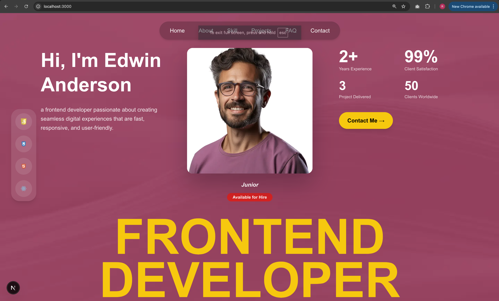

# 🎯 Portfolio Website - Riki Graha

> Personal portfolio website built with **Next.js 16**  designed to showcase my skills, projects, experiences, and personality in a modern, responsive, and user-friendly way.



---

## 📁 Project Structure

The project is organized using Next.js App Router structure. Key components are split into reusable sections:

### 🔹 Components (src/components/)
Each section of the portfolio is a standalone component for modularity and reusability:

1. **`Hero.tsx`** — Hero banner with introduction and call-to-action.
2. **`AboutSection.tsx`** — Personal bio, skills, and professional summary.
3. **`FeaturesSection.tsx`** — Highlight key features or services I offer.
4. **`TechnologiesSection.tsx`** — Showcase tech stack used in projects.
5. **`ComparisonSection.tsx`** — Compare my approach vs others (optional).
6. **`PortfolioSection.tsx`** — Display featured projects with images and links.
7. **`ExperiencesSection.tsx`** — Work history, roles, and achievements.
8. **`Testimoni.tsx`** — Client or peer testimonials.
9. **`QnASection.tsx`** — Frequently asked questions about me or my work.
10. **`ContactSection.tsx`** — Contact form + social media links.
11. **`Footer.tsx`** — Site footer with copyright and quick links.

### 🔹 Public Assets (`public/icons/`)
All static assets like SVGs and PNGs are stored here:
- Icons: `file.svg`, `globe.svg`, `next.svg`, `people.png`, etc.
- Images: `edwin.jpg`, `saran_tan.png`, `portfolio_1.png`, etc.
- Favicon: `favicon.ico`

### 🔹 App Layout (`src/app/`)
- `layout.tsx` — Global layout with metadata, fonts, and shared styles.
- `page.tsx` — Main page that composes all components.
- `globals.css` — Global CSS styles (Tailwind or custom).

---

## 🚀 Getting Started

### Prerequisites
- Node.js (v18 or higher)
- npm or yarn

### Installation
1. Clone the repository:
   ```bash
   git clone https://github.com/rikigraha/portofolio_riki_graha.git
   cd portofolio_riki_graha